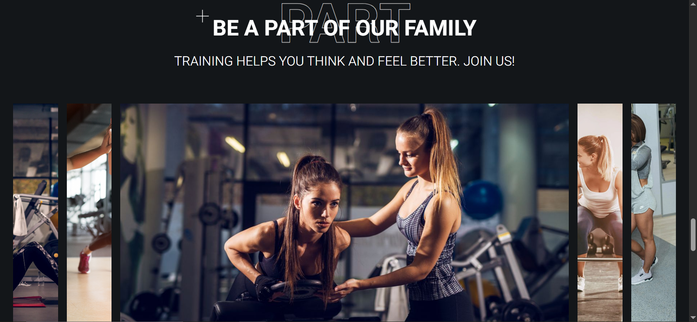

# kropfit-pet — Kropp Fitness Landing

Адаптивный лендинг фитнес-клуба, который я сверстала по найденному в интернете макету.  
Цель проекта — прокачать HTML/CSS (адаптивная вёрстка) и добавить интерактив на ванильном JavaScript.

**Демо (GitHub Pages):**  
https://ssmetanina.github.io/kropfit-pet/

## Технологии
- HTML (семантика, `visually-hidden`, корректные `alt`)
- CSS (переменные, flexbox, grid, media queries)
- Vanilla JavaScript
- Yandex Maps API (карта с кастомными метками)

## Что реализовано
- **Адаптивная вёрстка** (desktop / tablet / mobile)
- **Бургер-меню** для мобильной навигации
- **Интерактивная галерея-слайдер** (переключение активного слайда по клику)
- **Карта Яндекс** с несколькими метками и кастомной иконкой
- Оптимизации разметки: `loading="lazy"` для изображений

## Что я прокачала
- Структуру HTML и аккуратный нейминг классов
- Компонентные стили (кнопки, инпуты) и работу с CSS-переменными
- Flexbox и Grid на реальном макете + адаптивность
- DOM-события и управление классами (`toggle`, `click`)
- Подключение и настройку стороннего API

## Процесс
Сначала я собрала структуру секций и базовую верстку, затем настроила стили и адаптивность.  
После этого добавила интерактив: мобильное меню, галерею и карту с метками.  
Фокус проекта — **точность верстки, адаптивность и доведение до «готового» состояния**.

## Запуск локально
Проект статический — можно просто открыть `index.html`.

Для запуска через локальный сервер:
```bash
# VS Code Live Server
# или
python -m http.server 5173
